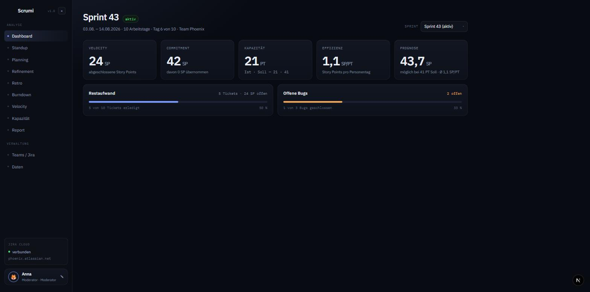
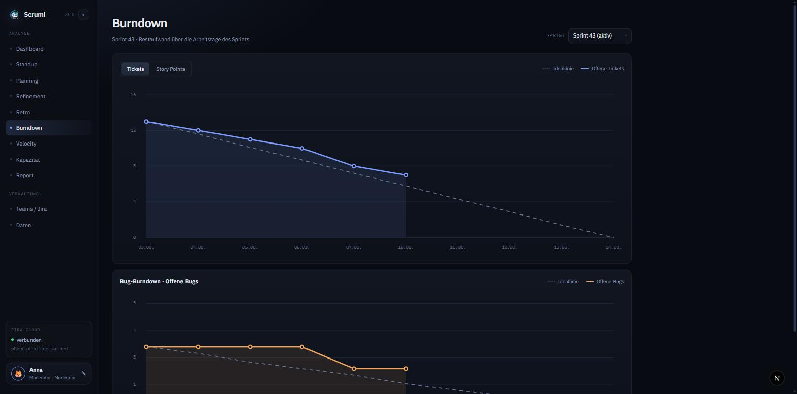
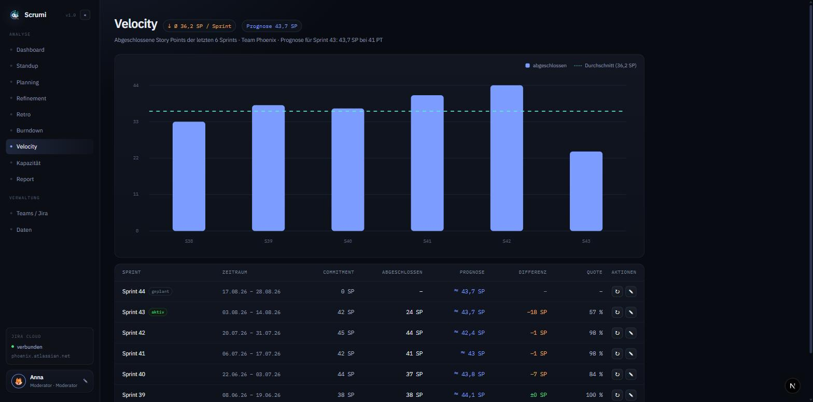
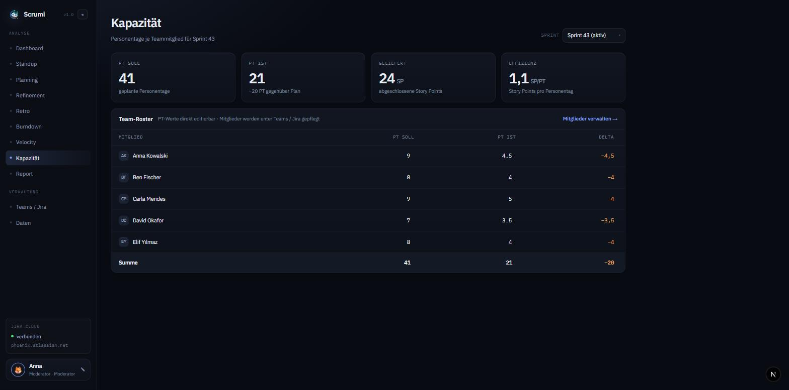
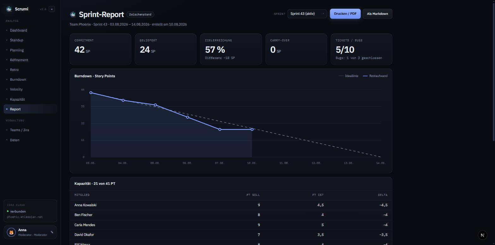
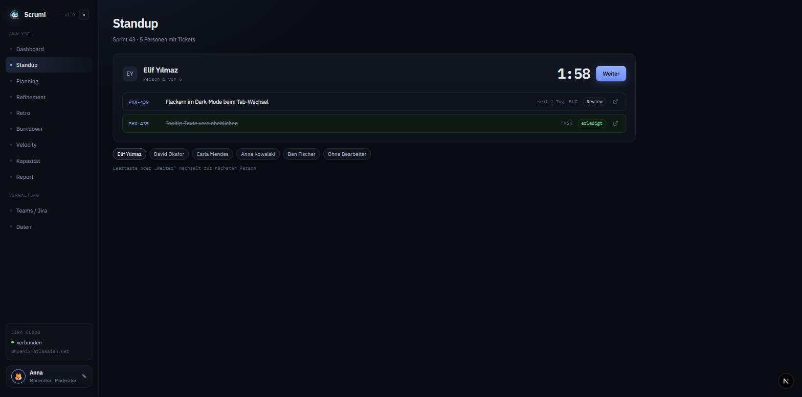
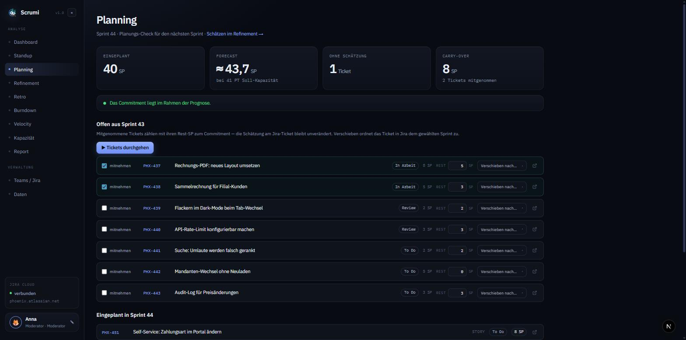
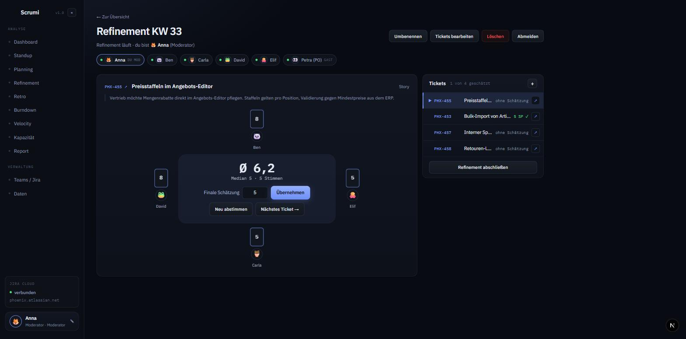
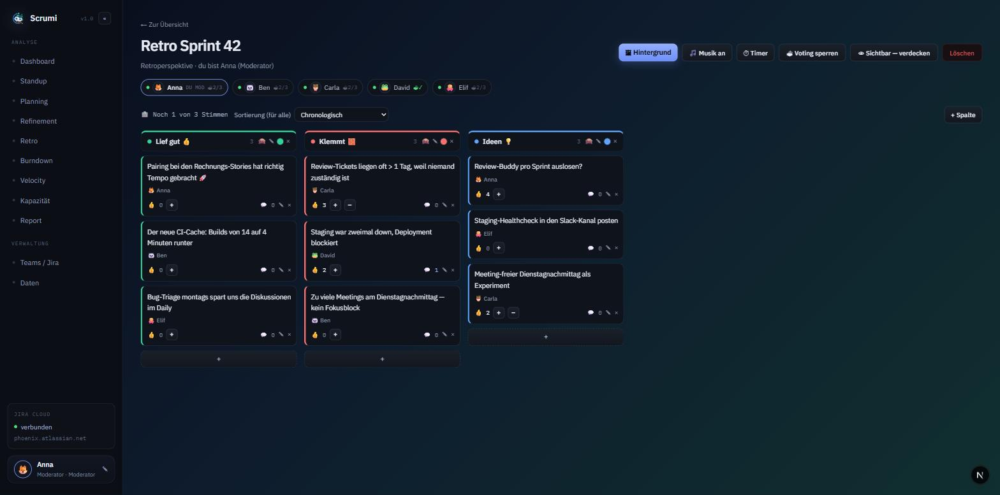

# Scrumi

Self-hosted, quelloffenes Werkzeug für den kompletten Scrum-Alltag —
mit automatischem Jira-Cloud-Sync, Planning Poker, Retro-Boards und
Sprint-Reports.

---

Scrumi holt sich Sprints und Tickets direkt vom Jira-Board und macht daraus
die Ansichten und Meetings, die im Sprint-Alltag wirklich gebraucht werden —
ohne Jira-Plugins, ohne Cloud-Abo, auf eigener Infrastruktur.

## Features

### Analyse & Kennzahlen

- **Dashboard** — der Sprint auf einen Blick: Velocity, Commitment
  (inkl. übernommener Carry-Over-Punkte), Kapazität, Effizienz und eine
  Prognose auf Basis der abgeschlossenen Sprints; dazu Restaufwand und
  offene Bugs als Fortschrittsbalken.
- **Burndown** — Ticket- und Story-Point-Burndown plus separates
  Bug-Burndown, jeweils mit Ideallinie; wird bei jedem Sync
  fortgeschrieben. Läuft der Sprint gut, gibt es Feenstaub — sind alle
  Tickets durch, Feuerwerk. 🎆

  

- **Velocity** — Trend über die abgeschlossenen Sprints mit Durchschnitt,
  Prognose und Tabelle inkl. Commitment, Differenz und Carry-Over-Quote.

  

- **Kapazität** — geplante vs. tatsächliche Personentage je Mitglied
  (direkt in der Tabelle editierbar), Team-Effizienz in SP/PT;
  Standard-Personentage pro Person werden für neue Sprints vorbelegt.

  

- **Sprint-Report** — Zwischenstand bzw. Abschlussbericht mit
  Zielerreichung, Burndown, Kapazitätstabelle und den Listen „Geliefert"
  und „Nicht geschafft" — als **Druck/PDF** oder **Markdown-Export**.

  

### Meetings

- **Standup** — Standup-Modus für den laufenden Sprint: pro Person die
  offenen Board-Tickets und das seit dem letzten Arbeitstag Erledigte,
  zufällige Reihenfolge, Redezeit-Countdown mit Überzieh-Statistik. Jede
  Card zeigt, wie lange das Ticket schon im aktuellen Status hängt — ab
  mehr als 5 Arbeitstagen mit roter Warnung.

  

- **Planning** — Planungs-Check für den nächsten Sprint: eingeplante
  Punkte gegen die Kapazitäts-Prognose (Ampel-Verdikt), Tickets ohne
  Schätzung, und die **Carry-Over-Liste** der offenen Tickets aus dem
  aktiven Sprint: mitnehmen (mit Rest-SP, ohne die Jira-Schätzung
  anzufassen) oder direkt nach Jira in den nächsten Sprint verschieben.
  Der **Durchgeh-Modus** führt Ticket für Ticket durch die Liste und lädt
  die Jira-Beschreibung live nach.

  

- **Refinement (Planning Poker)** — Schätzrunden am runden Tisch, ohne
  Login: Beitritt per Name und Emoji-Avatar, Rollen Schätzer / Moderator /
  Besucher. Ticket-Auswahl aus dem Jira-Backlog (Datagrid mit Suche und
  Mehrfachauswahl), Kartenwerte 1–20 plus „?", Aufdecken Sitz für Sitz,
  Median als Übernahme-Vorschlag, Konfetti bei Einstimmigkeit — und wer
  trödelt, bekommt eine 🍅 geworfen. Übernommene Schätzungen werden
  direkt ins Story-Points-Feld nach **Jira zurückgeschrieben**.

  

- **Retro** — Retro-Boards mit Templates (Start/Stop/Continue, Mad/Sad/Glad,
  4L, …), Verdeckt-Modus mit anonymem Schreiben und Aufdecken pro
  Teilnehmer, Voting mit Stimmen-Kontingent nach Freigabe, Timer,
  Karten-Kommentare, Zusammenführen per Drag & Drop, Emoji- und
  GIF-Support (Giphy, optional), Hintergrundbilder und generative
  Lofi-Hintergrundmusik direkt aus dem Browser.

  

### Jira & Betrieb

- **Jira-Sync** — automatisch im Intervall oder per Klick; Sprints,
  Board-Spalten, Bearbeiter und Status-Historie kommen direkt aus der
  Jira-Cloud-API. Der Sync ist inkrementell (abgeschlossene Sprints werden
  übersprungen, `?full=1` lädt alles neu) und läuft pro Team fehlertolerant.
  Manuell gepflegte Kapazitätsdaten werden nie überschrieben.
- **Backup** — kompletter Datenbestand als JSON-Export und -Import unter
  **Daten**.
- **Login (optional)** — mit gesetztem `APP_PASSWORD` schützt ein
  Passwort-Login die komplette App; ohne bleibt sie offen (z. B. hinter
  einem Reverse-Proxy im internen Netz).
- **Live-Sync in den Meetings** — Refinement und Retro laufen über
  WebSockets (mit Long-Polling-Fallback) und zeigen live, wer gerade
  anwesend ist.

## Schnellstart (Self-Hosting)

Voraussetzung: Docker + Docker Compose.

1. `.env` anlegen (siehe `.env.example`) und die `JIRA_*`-Variablen setzen
   (für den ersten Start optional — Teams lassen sich auch ohne Sync anlegen).
2. Alles starten: `docker compose up -d`
   — startet Postgres **und** Scrumi; die Datenbank-Migrationen laufen beim
   Start des Scrumi-Containers automatisch (`prisma migrate deploy`).
3. Im Browser: `http://localhost:3000` → unter **Teams / Jira** ein Team mit
   Jira-Board-ID anlegen.

Der Sync läuft automatisch im Intervall `SYNC_DEFAULT_INTERVAL` (Minuten) und
kann jederzeit über **🔄 Jetzt synchronisieren** ausgelöst werden.

### Ohne Docker (lokal)

1. Postgres bereitstellen und `DATABASE_URL` in `.env` setzen.
2. `npm ci`
3. `npx prisma migrate deploy`
4. `npm run build && npm start`

## Konfiguration

| Variable | Wirkung | Default |
|---|---|---|
| `DATABASE_URL` | Postgres-Verbindung | – |
| `APP_PASSWORD` | Passwort-Login; leer = Login deaktiviert | leer |
| `JIRA_BASE_URL` | Jira-Cloud-URL; auch Basis für Ticket-Deeplinks | leer |
| `JIRA_EMAIL` | Jira-Konto für die API (Basic Auth) | leer |
| `JIRA_API_TOKEN` | Jira-API-Token | leer |
| `JIRA_STORY_POINTS_FIELD` | Story-Points-Custom-Field | `customfield_10016` |
| `JIRA_BUG_ISSUE_TYPES` | Vorgangstypen, die als Bug zählen (kommagetrennt) | `Bug,Fehler` |
| `SYNC_DEFAULT_INTERVAL` | Sync-Intervall in Minuten | `60` |
| `GIPHY_API_KEY` | GIF-Suche in der Retro; ohne Key kuratierte Fallback-Galerie | leer |
| `PORT` | Server-Port | `3000` |

## Hinweise

- Damit im Standup jede Person ihren Redeslot bekommt, müssen die
  Teammitglieder unter **Teams / Jira** gepflegt sein und den
  Jira-Anzeigenamen entsprechen.
- Über `metricsSince` (pro Team) lassen sich alte Sprints aus den
  Kennzahlen ausblenden.

## Tech-Stack

Next.js 15 (App Router) · React 19 · Prisma + PostgreSQL · WebSockets · Vitest

## Entwicklung

- `npm run dev` — Dev-Server (eigener Node-Server mit WebSocket-Support)
- `npm test` — Tests (Vitest)
- `npx prisma migrate dev` — Migrationen

## Lizenz

MIT
